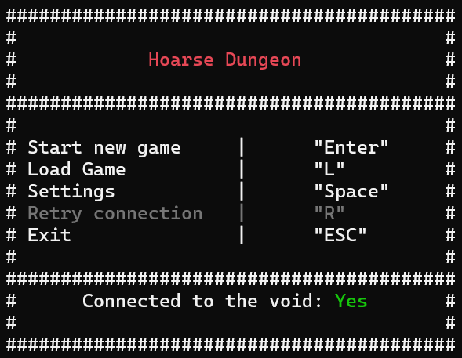
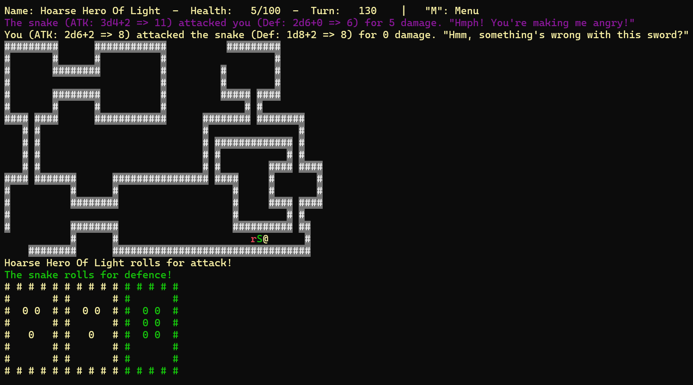
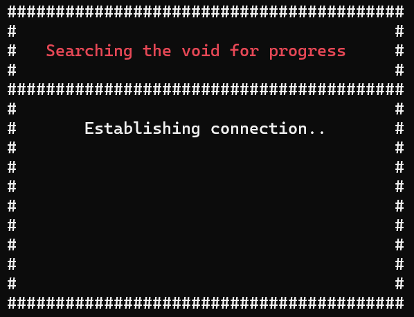
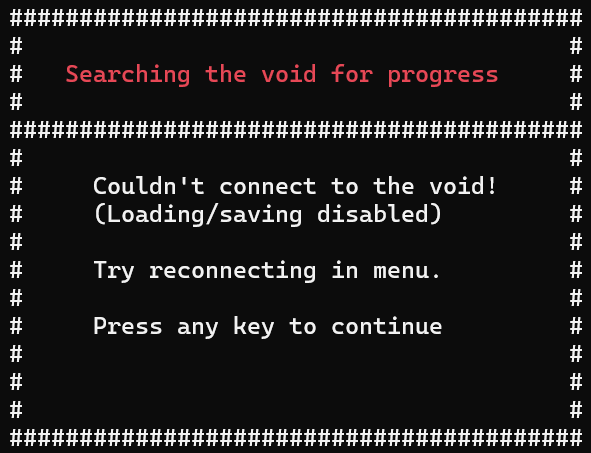
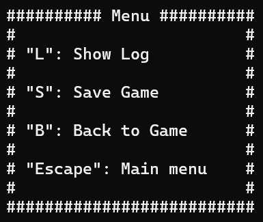
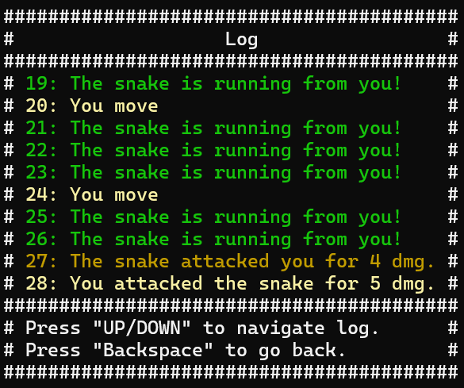
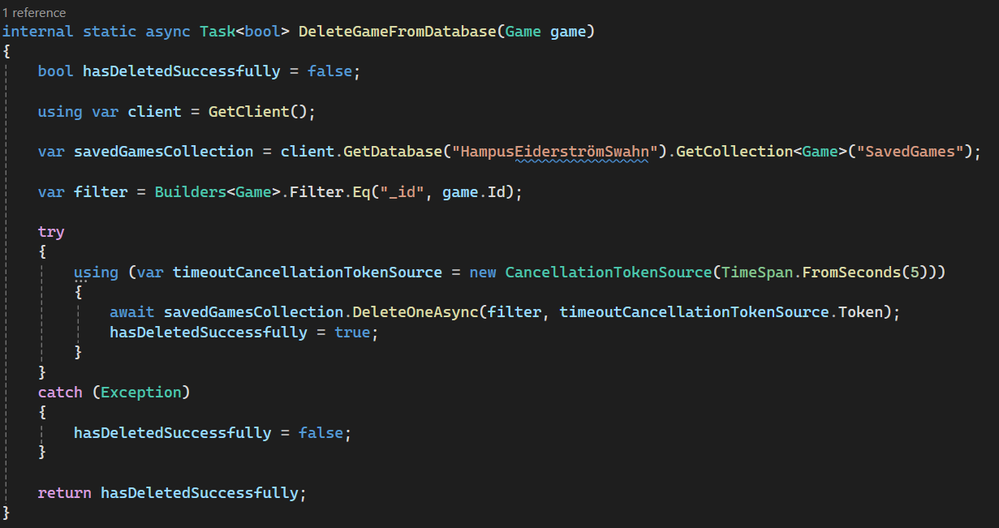
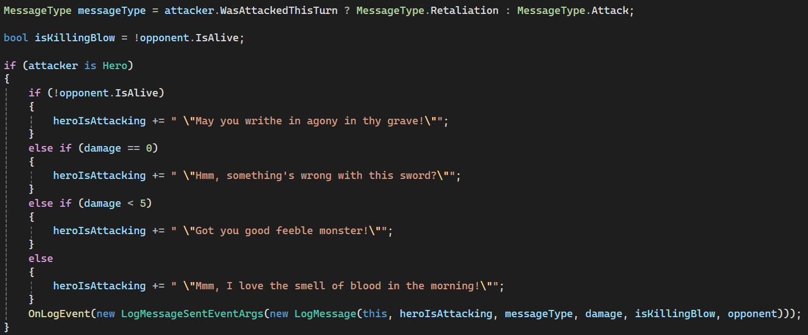

# Hoarse Dungeon Crawler

## Overview

This console dungeon crawler game takes the player on a journey down a dark and dangerous dungeon.

## Features

These are the main features of the game:

### Explore and battle

Discover the dungeon - one step at a time.

Fight two different kinds of monsters. Animate your dice throws.

### Saving/Loading

Save your game and load it at a later time via connection to MongoDB.

#### Keeping the player up to date with what's going on:

#### Error handling.

### Menu and log

Take a look at your Main and In-Game menus - "Did you say TWO menus?!" 

What happened 5 turns ago? Check your log!

### Features under development

- Actual win condition
- More than one level

"Should have worked these out before animating dice throws" you say!?

You are right.

## Code talk

This is a continuation of a school project I made during my first course of programming school.
The assignment this time was to use MongoDB for saving and loading games and also introducing a
log.

This version I've been putting some effort into introducing the Game, DatabaseHandler, ConsoleWriter 
and more classes, moving some stuff that was handled in weird places in the first version of the app.

I made a choice not to make a rehaul of the actual game loop and it's workings although it could definitely use some work :-)

### Code examples

All connections with the database have some form of error handling:

### Using events as a means of communication between level elements and the Game

## Setup

To run the app you will need to have access to a MongoDB server.

You'll also need to set up user secrets for your connection string to the database like:

{ "ConnectionString" : "Your connection string"" }

## Enjoy!

/hoarse
